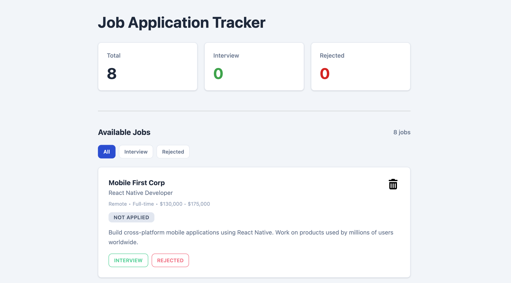

<h1 align="center">📋 Job Application Tracker</h1>

A simple job tracking app to manage job applications — mark interviews, track rejections, and stay on top of your job search.

<a href="https://ratul-ai.github.io/PH-Assignment-04/">🔗 Live Demo</a>

---

## ✨ Features

- Track jobs with company, position, location, type, and salary  
- Mark status: Not Applied / Interview / Rejected (**toggle on click**)  
- Delete jobs from the list  
- Stats dashboard with counts of total, interviews, and rejections  
- Filter jobs by status (All / Interview / Rejected)  
- Fully responsive layout  

---

## 🖼 Preview

#### Dashboard 
  
 
---

## 📚 What I Learned & How I Applied It

- **DOM manipulation** — Job cards, badges, stats, and empty states are dynamically generated at runtime using `innerHTML`. All user actions (marking status, deleting, switching tabs) trigger a full `render()` to update the UI from the `jobs` array.  
- **Event delegation** — Instead of adding listeners to each button, a single listener on the parent handles clicks using `e.target.closest("[data-action]")`, keeping the code clean even after re-rendering cards.  
- **Array methods** — `filter` removes deleted jobs or applies tab filters, `find` locates jobs by id, and `map` converts the jobs array into HTML strings for rendering.  
 

---

## ⚙️ Challenges I ran into

- **Buttons not responding after re-render** — Adding click listeners inside `renderCard()` caused listeners to be lost after every render. Fixed by **event delegation**, with one listener on the parent container that always remains in the DOM.  

---

## 🛠 Built With

HTML · Tailwind CSS v4 · DaisyUI v5 · Vanilla JavaScript

---

## 👨‍💻 Author

**Ratul** - Currently learning web development and building small projects to practice.  
 

[GitHub](https://github.com/Ratul-Ai) | [Linkedin](https://www.linkedin.com/in/md-ratul242/)